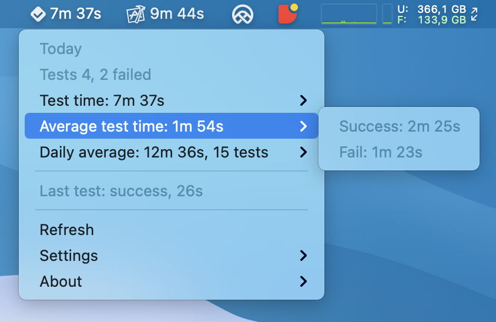
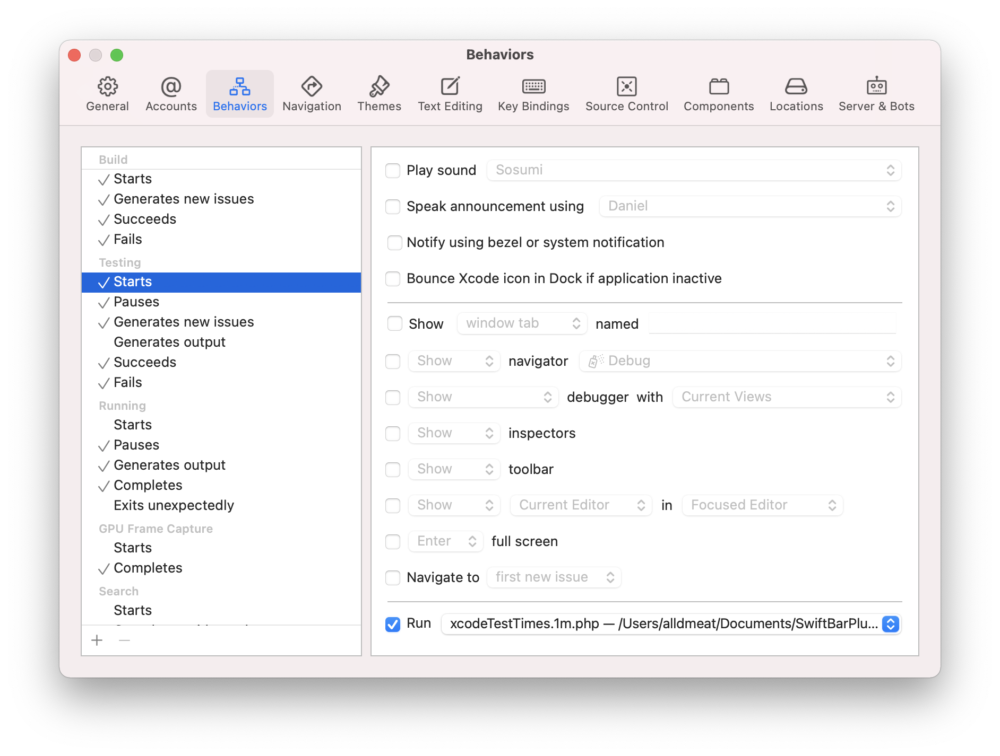
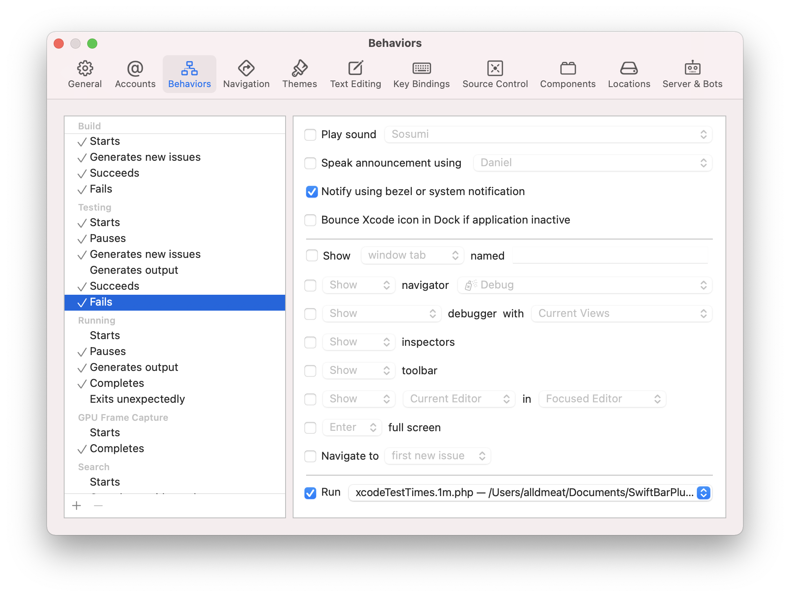
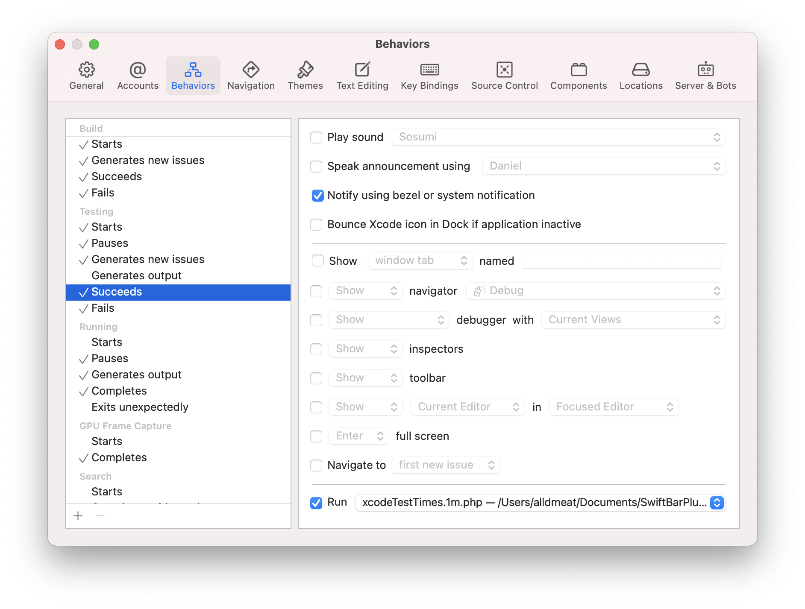

# Xcode test times


Have you ever wondered how much time a day you spend waiting for Xcode to do your tests? Wonder no more, this [BitBar](https://getbitbar.com/) or [SwiftBar](https://github.com/swiftbar/SwiftBar/) plugin shows the time wasted right in your menu bar!



## Installation

You can use this plugin with BitBar (seems dead, but still functional project) or newer Swiftbar (in development)

So first install [BitBar](https://github.com/matryer/bitbar#get-started) or [SwiftBar](https://github.com/swiftbar/SwiftBar#how-to-get-swiftbar)

On the first run select a directory you wish to use as your plugin directory, for example `~/BitBarPlugins`.

### Plugin installation

Download the `xcodeTestTimes.1m.php` file from the `sources` folder in this repository and place it the plugin folder and make it executable.

You can do it manually or via terminal

```bash
cd ~/BitBarPlugins
curl https://raw.githubusercontent.com/AllDmeat/xcode-test-times/master/sources/xcodeTestTimes.1m.php --output xcodeTestTimes.1m.php
chmod +x xcodeTestTimes.1m.php
```

If you now refresh BitBar data you should see the script being loaded.

### Xcode setup

The final step is to make Xcode call the script on every test. 

To do this open `Preferences` | `Behaviors` in Xcode and set the script to `Run` when the `Test` starts



fails



and succeeds



### Optional setup

The script is called `xcodeTestTimes.1m.php` so BitBar will refresh the data every minute. If you want to use a different refresh interval, just change the `1m` in the script name to your desired interval. 

You can find [more info about the refresh intervals in the BitBar documentation](https://github.com/matryer/bitbar#configure-the-refresh-time).

### Original script

This script is build on top of [xcode-build-times](https://github.com/matopeto/xcode-build-times), originally written by matopeto

## License

This project is licensed under the MIT License - see the [LICENSE](LICENSE) file for details.
